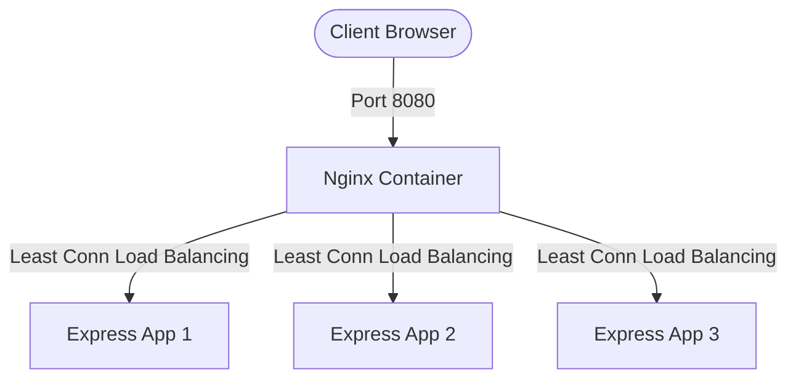

# Nginx & Docker Load-Balanced Cluster

A high-availability, load-balanced Node.js web application cluster using Nginx as a reverse proxy, fully automated and orchestrating within Docker Compose.

---

## 🏗️ Architecture Overview

The system runs completely containerized inside a shared Docker bridge network:



1. **Nginx Reverse Proxy (`nginx:alpine`)**:
   - Listens internally on port `80` (mapped to host port `8080`).
   - Uses the **Least Connections** (`least_conn`) algorithm to balance incoming traffic.
   - Configured with proactive failover (automatically retries the next instance if one fails or times out).
2. **Application Cluster (Node.js/Express)**:
   - Three independent app containers (`app1`, `app2`, `app3`) running on port `3000`.
   - Each app identifies itself via the `APP_NAME` environment variable when serving requests.

---

## 📁 Project Structure

* [compose.yaml] - Defines and spins up the multi-container environment.
* [nginx.conf] - Custom Nginx configuration specifying routing rules, timeouts, and upstream failovers.
* [Dockerfile] - Production-ready Docker build instructions for the Node.js Express server.
* [server.js] - Simple Express app endpoint that serves a file and logs which container served it.
* [index.html] - Static HTML file served by the Node.js instances.

---

## 🚀 Getting Started

### Prerequisites
Make sure you have [Docker Desktop](https://www.docker.com/products/docker-desktop/) installed and running on your system.

### Running the Project

1. Navigate to the project directory:

2. Build and launch all services in detached mode:
   ```powershell
   docker compose up -d --build
   ```
3. Open your browser and go to:
   ```
   http://localhost:8080
   ```

---

## 🛠️ Operational & Debugging Commands

Here are the most useful commands to manage and monitor this architecture:

### 1. View Service Status
Check which containers are running and their mapped ports:
```powershell
docker ps
```

### 2. Stream Logs
View and monitor incoming request distributions dynamically:
```powershell
# Stream logs for all containers
docker compose logs -f

# Stream logs for only the Nginx load balancer
docker compose logs -f nginx
```

### 3. Test Load Balancing
You can run a command line loop or curl requests to see Nginx distribute traffic:
```powershell
curl.exe -i http://localhost:8080
```
Check your logs via `docker compose logs` to see which container (`app1`, `app2`, or `app3`) handled the request.

### 4. Stop the Environment
To stop and clean up all containers and network interfaces:
```powershell
docker compose down
```
